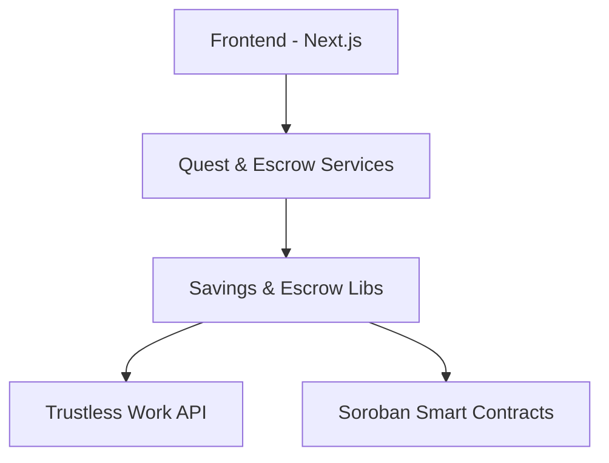

# TrustQuest

TrustQuest is an escrow-backed savings and rewards platform built for the Stellar network with Soroban smart contracts.

TrustQuest solves trust and consistency problems in savings systems common in emerging markets by introducing transparent savings quests, escrow-backed sponsor rewards, and guaranteed payouts based on milestone achievements.

## Product Concept

The platform focuses on:
1. **Savings Discipline**: Encouraging users to build financial consistency through milestones.
2. **Escrow-Backed Rewards**: Ensuring that rewards are locked and guaranteed before a quest begins.
3. **Transparent Payouts**: Using Soroban smart contracts and Trustless Work EaaS to automate reward releases.

## Current Focus

1. **Stellar Wallet Integration**: Secure connection and transaction signing via Freighter, Albedo, and xBull.
2. **Quest Engine**: Core logic for quest participation, milestone tracking, and reward eligibility.
3. **Escrow Orchestration**: Integration with Trustless Work for secure fund management.

## Architecture



## Local Development

### Prerequisites
- Node.js 20+
- npm

### Install
```sh
npm install
```

### Run The DApp
```sh
npm run dev
```

## License
This project is licensed under the MIT License.
